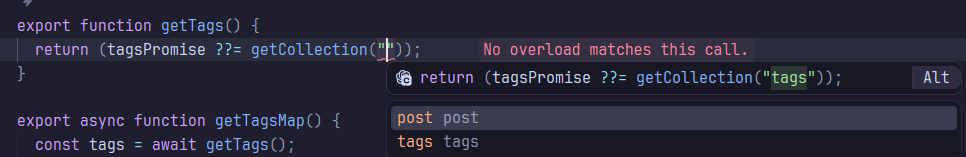
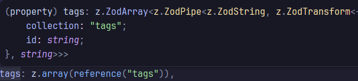

import Callout from "#components/molecules/callout.tsx";

<Callout type="info" title="Automatically Translated post">

This document is automatically translated from [Original Post](/post/create-blog-2), used Opus 4.8 LLM for trnslation.

</Callout>

# What is Content?

[Astro Content Collections documentation](https://docs.astro.build/en/guides/content-collections/)

In Astro, you can define and manage data that has a consistent structure as content.

Astro recommends using content in the following situations.

- When performance is a primary concern and you want to access the data at build time
- When the data is not dynamic (blog posts, API documentation, product manuals, etc.)
- When you want to use caching and build-time optimizations
- When you need image optimization or MDX processing
- When you want to load the data once and use it across multiple builds

The keyword running through most of what's described here is defining and processing **data that, at build time, needs a high level of optimization and static data handling**.

Because of these characteristics, Astro recommends against using Content for dynamic data—such as data that must be updated in real time or loaded from a DB.

## Setting up a Content Schema

Astro uses [Zod](https://zod.dev/) to define the schema of a Content Collection.

This schema is parsed at build time and saved as a usable type file in the project's `.astro` folder.

As you can see in the image below, the types generated at build time provide the IDE with context for autocompletion, as well as type checking at build time.


## Applying it in this blog

Currently, this blog manages data using Content Collections for three elements.

### Blog posts

Naturally, blog posts are a dataset that perfectly fits the conditions above. I defined three fields in the FrontMatter—title, tags, and locale—and set it up so that mdx is processed at build time and output as static HTML.

Performance is a primary concern, the page must be completed at build time (so that the crawling engine can take away completed data), and the data is static.

The post Collection is defined as follows.

```ts
const post = defineCollection({
  loader: glob({ base: "./src/content/posts", pattern: "./**/*.{md,mdx}" }),
  schema: z.object({
    title: z.string(),
    locale: z.enum(["en", "ko"]),
    tags: z.array(reference("tags")),
  }),
});
```

`loader` is the part that defines the loader used to load Content; here I used the `glob` loader to load all md/mdx files under the `./src/content/posts` folder.

The schema here is the FrontMatter you write in the md/mdx files—data that is accessible at compile time.

For example, the FrontMatter in this post is defined as follows.

```mdx
---
title: 나만의 개발 블로그/포트폴리오 만들기 2 - Content, Path Variable과 Static Paths
tags: [frontend]
locale: ko
---
```

Data defined this way is accessible via the Content's `data` property.

The Page currently used to compile this post loads and uses the data in the following way.

_To keep the code explanation brief, I've omitted the parts that load headings and inject them into the Navbar, the parts that define the path, and so on._

```astro
---
const { post } = Astro.props;

const { Content, remarkPluginFrontmatter, headings } = await render(post);
const filtered_headings = headings.filter((heading) => heading.depth < 3);
const { title, tags, locale } = post.data;
const menus = getDefaultNavMenus(locale);
---

<DefaultLayout title={post.data.title} menus={menus} locale={locale} do_index>
  <div>
    <div class="flex flex-col gap-0.5 mb-4">
      <p class="font-bold text-3xl">{post.data.title}</p>
      <p class="text-secondary-foreground text-lg">
        Written on : {remarkPluginFrontmatter.pubDate}
      </p>
      <p class="text-secondary-foreground text-lg">
        {remarkPluginFrontmatter.minutesRead}
      </p>
    </div>
    <div class="flex flex-col gap-1.5 pl-2 pr-5" id="post-content">
      <Content />
    </div>
  </div>
</DefaultLayout>
```

As mentioned earlier, because `post.data` already has the type loaded from zod defined on it, it supports autocompletion and type checking.

### Post tags

The tags that classify the content of blog posts are also defined as a Content Collection.

```ts
const tags = defineCollection({
  loader: glob({ base: "./src/content/tags", pattern: "*.json" }),
  schema: z.object({
    name: z.string(),
    description: z.string(),
    related: z.array(reference("tags")),
  }),
});
```

These tags are planned to be used later when implementing features such as searching posts by tag, and name, description, and so on are planned to be used as content actually displayed in the UI.

Here I can explain something I couldn't cover in the blog post section above—namely, the `reference()` schema definition.

`reference()` is a schema definition function that references another Content Collection, and the generated type is not `string` but a parseable Content Entry type.

You can see that both the blog post above and this tag schema use `z.array(reference("tags"))` to define an array type that expresses tag references.

The image below shows the type of the `tags` property defined on the `post` Collection; you can confirm that it is a reference type from which you can load the data, rather than the `tags` Collection itself.



### Localization

The multilingual content is also defined as a Content Collection.

However, rather than being defined directly in Astro, this collection is managed by `intlayer`, the multilingual plugin currently used in this blog, so it is not defined in `content.config.ts`.

```ts
import { t, type Dictionary } from "intlayer";

const postsContent = {
  key: "posts",
  content: {
    title: t({
      en: "Recent Writings",
      ko: "최근 작성된 글",
    }),
    description_1: t({
      en: "Writings about my experiences, thoughts, and interests.",
      ko: "여러분께 이야기하고 싶은 경험, 생각, 관심사를 공유합니다.",
    }),
    description_2: t({
      en: "Roughly two posts per month - but I try to post as often as possible.",
      ko: "한달에 약 2개 정도의 글을 올리지만, 가능한 한 자주 올리기 위해 노력합니다.",
    }),
  },
} satisfies Dictionary;

export default postsContent;
```

# Path Variables and Static Paths

[Astro's Dynamic Routes documentation](https://docs.astro.build/en/guides/routing/#dynamic-routes)

### Path Variables

If Content Collections are for accessing non-dynamic data at build time, then in order to actually display content of this same schema on a web page,
you need to define the page so that it includes a Path Variable, and tell Astro which data exists at which path.

First, to define a Path Variable for use in a page, you express the page's path variable in the filename, e.g. `[variableName].astro`.

If you expect multiple segments to come in, you prefix it with `...`.

For instance, the page that currently displays posts is defined as `pages/post/[...postid].astro`.

### Static Paths

Even when a Path Variable exists, Astro doesn't know what values will come into it, so you have to define the possible incoming pages in advance via routes.

These routes are called Static Paths, and to provide these Static Paths to Astro, you export a `getStaticPaths()` function.

```ts
export const getStaticPaths = (async () => {
  const posts = await getCollection("post");
  return posts.flatMap((post) => {
    if (post.filePath === undefined) return [];
    const postId = getContentKey(post.filePath);
    return {
      params: { postid: postId },
      props: { post },
    };
  });
}) satisfies GetStaticPaths;
```

The code above is the `getStaticPaths()` function for blog posts; you can see it loads the post collection defined earlier, converts it into Static Paths, and passes the Post data to each Route as a Prop.

The reason for passing post as a prop rather than loading it again at render time is that getStaticPaths runs only once, when parsing the pages, whereas the script defined in the page is called every time a single page is built.

This kind of build-time optimization can also be seen when managing the tags collection.

```ts
import { getCollection } from "astro:content";

let tagsPromise: ReturnType<typeof getCollection<"tags">> | undefined;

export function getTags() {
  return (tagsPromise ??= getCollection("tags"));
}

export async function getTagsMap() {
  const tags = await getTags();
  return new Map(tags.map((tag) => [tag.id, tag]));
}
```

The tags collection is loaded once, and after that it isn't reloaded each time it's used—it's stored and managed within that ts module's scope—so the tags collection ends up being loaded only once.

### Pagination

[Astro Pagination Guide](https://docs.astro.build/en/guides/routing/#pagination)

Astro supports an API that automatically slices a large list to provide Pagination.

In this blog, I use it to pre-compile the Post List and load it as the user scrolls.

```ts
export const getStaticPaths = (async ({ paginate }) => {
  const posts = await Promise.all(
    (await getCollection("post")).map(async (post) => {
      return {
        post: post,
        renderResult: await render(post),
      };
    }),
  );

  const paths = localeMap(({ locale }) =>
    paginate(
      posts
        .filter((p) => p.post.data.locale === locale)
        .toSorted((a, b) => {
          const aPubDate = a.renderResult.remarkPluginFrontmatter.pubDate;
          const bPubDate = b.renderResult.remarkPluginFrontmatter.pubDate;
          // Compare string dates - older as last
          if (aPubDate > bPubDate) {
            return -1;
          }
          if (aPubDate < bPubDate) {
            return 1;
          }
          return 0;
        }),
      {
        params: { locale: getPrefix(locale).localePrefix },
        pageSize: 10, // Element counts per page
      },
    ),
  );

  return paths.flat();
}) satisfies GetStaticPaths;
```

This page is `pages/[...locale]/posts/fragment/[page].astro`. It has two path variables, and since both are data generated by a library rather than static data,
you can see that it makes active use of arrays and maps to generate the Static Paths.

It shows filtering posts by the given locale, sorting them newest-first, and splitting them into pages using `paginate`.
