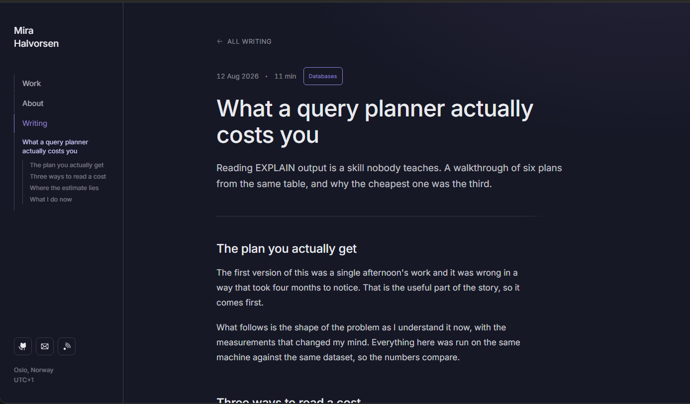
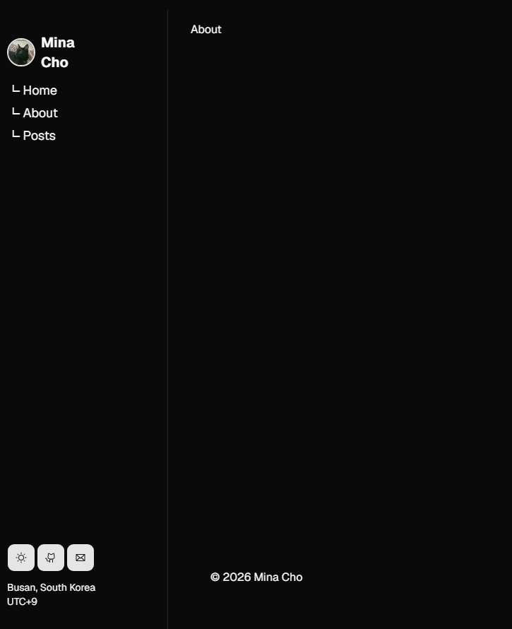

import Callout from "#components/molecules/callout.tsx";

이전의 Gatsby 기반의 블로그에서 Astro 기반으로 변경하면서, 개발 블로그 개발에 대한 내용을 간단하게 적어볼까 합니다.

## Astro란 무엇인가?

[Astro 프로젝트 웹사이트](https://astro.build/)

Astro는 컨텐츠 중심의 웹 페이지 개발을 위한 프레임워크로, SPA(Single Page Application) 방식을 사용하는 React 등의 UI 프레임워크와는 달리, 정적 웹 사이트 생성을 중점으로 수행합니다.

**장점**

- 모든 페이지를 정적 웹 사이트로 컴파일하는 것을 목표로 하며, 이를 통해 얻는 성능적인 이점을 극대화합니다.
- 웹 검색 엔진에 색인될 때, 이미 정보가 완성된 웹 페이지가 색인되므로 검색에서의 정확도가 훨씬 높습니다.
- 템플릿 방식이고, 구조를 정의한 후 컨텐츠를 작성하는 방식이기 때문에, 중복되는 코드가 굉장히 많이 줄고 간결해집니다.
- React, Vue, Svelte 등의 다양한 UI 프레임워크를 지원하면서도, 이 모든 UI 컴포넌트를 전부 하나의 정적 웹사이트로 전환 가능합니다.
- 많은 컨텐츠 타입(Markdown, Json, MDX 등)을 지원하며, 다른 컨텐츠 타입간의 지원 역시 굉장히 매끄럽게 연결됩니다.
- 이런 컨텐츠 타입, UI 프레임워크, 그리고 다양한 전처리/후처리 기능을 integration 형식으로 지원하며, 쉽게 설치/삭제하거나 필요한 기능을 직접 추가하기도 어렵지 않습니다.

**단점**

- 결국 모든 내용을 빌드 시점에 박아넣어야 성능적인 이점을 볼수 있기 때문에, 빌드 과정이 복잡하고 시간이 오래 걸리게 됩니다.
- 결국 모든 페이지를 정적으로 작동시킬 수는 없으므로(일부분의 로직은 JS가 필요합니다), 어느 부분까지 클라이언트단에서 처리할 것인지를 결정해야 하는데, 이 부분이 굉장히 비직관적이고 이해하기 어려울 수 있습니다.
- SPA 웹 페이지와 비교하여 SSR/SSG 웹 페이지가 가지는 모든 단점들(다른 페이지로 이동 시 웹 요청 수행, 로드가 완료되기 전까지 웹 페이지는 로딩)을 결국 가지게 됩니다.
- 결국은 코드 외적인 부분(파일시스템, 외부 API/데이터베이스 요청, json 등의 데이터 정의 등)에서 코드의 구조나 내용이 결정되는 정적 웹 생성기 특성상, 완전히 신뢰 가능한 타입 시스템을 지원하지 않습니다(any, {"Map<string, any>"} 등의 불완전/모호한 타입을 써야 하는 경우가 많습니다).

그럼에도 불구하고, Astro를 고른 이유는 다음과 같습니다.

1. 현재 존재하는 정적 웹 페이지 생성기 중 그나마 가장 넓은 타입 안정성 지원

   많은 정적 웹 페이지 생성기의 가장 큰 단점 중에 하나로 - 메타데이터, 컨텐츠 타입, 생성된 정보 등에 대한 타입 안정성이 굉장히 낮은 문제들이 있습니다(특히, GatsbyJS를 사용할 때 관련해서 많은 문제를 겪었던 거 같습니다).
   Astro는, 제가 느끼기에 지금 선택 가능한 정적 웹 페이지 빌드 유틸리티 중 **그나마** 가장 확실한 타입 안정성을 자체적으로 생성하는 타입 파일을 통해 제공합니다.

2. React 외에도 다른 UI 라이브러리를 사용 가능합니다.

   위의 장점에도 작성한 것이지만, Vue, Svelte 등의 프레임워크도 사용 가능합니다. 단순히 글을 남기는 공간 이상으로, 이 웹 페이지가 포트폴리오로써, 그리고 연습장으로써도 활용될 수 있음을 고려하였을 때, UI 프레임워크가 고정되지 않음은 선택에 있어 꽤 큰 가산점을 주었습니다.

3. 타 프로젝트와 비교해도 굉장히 높은 문서화 수준

   Astro는 오픈 소스 프로젝트 중 굉장히 문서화가 잘 되어 있는 편에 속합니다. 자체 cli, 설정, 컴포넌트 정의 문법(astro는 .astro 파일을 사용하여 내부 컴포넌트/레이아웃을 정의합니다) 등이 전부 새로운 만큼 - 높은 문서화 수준은 굉장히 중요한 고려 사항중 하나였습니다. 실제로 개발하면서 AI 등에게 직접 물어보는 것보다도, 문서 내에서 찾거나, 예시를 찾아 사용하는 것이 훨씬 빠르고 경제적이었던 케이스가 있었습니다.

여기에 - 저는 디자인을 굉장히 못 하기 때문에, Claude Design을 활용하여 기본적인 웹 페이지 틀을 잡고, [shadcn/ui](https://ui.shadcn.com/)를 사용하여 UI를 구현했습니다.


## React, Astro, Shadcn, 정적 웹 사이트.

처음 구간에서는 크게 어려운 부분이 없었습니다. 문법이 이해하기에는 그렇게 어렵지 않았고, SSR/SSG에 어느정도 익숙해져 있던 저로써는 Hydration 등의 개념에 대해서도 얕게나마 이해하고 있었기 때문에, 가능한 한 모든 컴포넌트가 정적으로 컴파일되도록 작성했으나 - 문제가 생기기 시작했습니다.

### shadcn/ui는 정적 웹 페이지 생성기와 친하지 않습니다.

문제는 왼쪽 사이드에 있는 Navbar를 개발하면서부터 시작됐습니다. `Avatar`를 사용하여 제 프로필 이미지를 표시할려고 하는데, 그냥 빈 이미지만 나오고 아무것도 처리되지 않았습니다.

```ts
/**
 * The image to be displayed in the avatar.
 * Renders an `` element.
 *
 * Documentation: [Base UI Avatar](https://base-ui.com/react/components/avatar)
 */
export declare const AvatarImage: React.ForwardRefExoticComponent<
  Omit<AvatarImageProps, "ref"> & React.RefAttributes<HTMLImageElement>
>;
export interface AvatarImageState extends AvatarRootState {
  /**
   * The transition status of the component.
   */
  transitionStatus: TransitionStatus;
}
export interface AvatarImageProps extends BaseUIComponentProps<
  "img",
  AvatarImageState,
  React.ComponentPropsWithRef<"img">
> {
  /**
   * Callback fired when the loading status changes.
   */
  onLoadingStatusChange?: ((status: ImageLoadingStatus) => void) | undefined;
}
export declare namespace AvatarImage {
  type State = AvatarImageState;
  type Props = AvatarImageProps;
}
```

문제는 - shadcn의 내부 UI 라이브러리, BaseUI에서 `AvatarImage`를 동적으로 로딩하기 위해, 내부에서 `TransitionStatus`를 상태 관리하면서, Astro가 컴파일하는 시점에 `AvatarImage`가 로드되지 않은 상태로 Dehydrate 시키며 발생하는 문제였습니다.

더 큰 문제는 - 많은 부분을 React 내부의 상태 관리에 의존하고 있는 shadcn/ui으로써, 이런 lazy loading 관련한 문제가 계속 발생할 것으로 예상된다는 점입니다.

### 해결책 - 가능한 한 상태 관리가 필요한 컴포넌트를 제외하는 것을 목표로

[Astro - Client Directives](https://docs.astro.build/en/reference/directives-reference/#client-directives)

Astro에서는 Client Directive라는 방법을 통해 컴포넌트가 어떤 식으로 Hydrated될지 결정 가능합니다. 이 방법을 사용하지 않으면 기본적으로 모든 컴포넌트는 정적 HTML/CSS로만 컴파일되며, 여기에서 `AvatarImage` 내부에서 "초기값으로 설정 > 이미지 로드 > 컴포넌트를 불러온 이미지로 업데이트" 하는 일련의 과정을 담은 JS가 전부 dehydrated되며 이미지가 로딩되지 않게 된 것입니다.

따라서 - `Navbar` 컴포넌트를 클라이언트에서 Hydrate시키기 위해, `client:load`를 추가해 주었습니다.

<Callout type="info" title="client:load">

`client:load`는 컴포넌트가 클라이언트에 마운트될 때, 바로 서버에서 Hydration
JS를 불러와 클라이언트에서 실행시키는 directive입니다.

</Callout>

```astro
<!-- default-layout.astro -->
<div class="shrink-0 min-w-60 py-4">
  <!-- Navbar on left side -because shadcn relies on client state - need hydration -->
  <Navbar menus={menus} client:load />
</div>
```

```tsx
/* Navbar.tsx */
<Avatar size="lg" className="border-2 border-primary">
  <AvatarImage src={profile} alt="Profile Image" />
  <AvatarFallback>MC</AvatarFallback>
</Avatar>
```

이렇게 함으로써, Avatar 컴포넌트가 Dehydrated 된 채로(이미지를 불러오지 않은 상태일 것이므로, AvatarFallback을 먼저 표시딜 것입니다), 클라이언트가 Hydrate될 때, 컴포넌트에 등록되어 있는 훅이 실행되며 `AvatarImage` 컴포넌트를 통해 이미지를 불러올 수 있게 됩니다.

이걸로 문제를 해결했다고 생각했으나 - 다시 새로운 문제를 만나게 됩니다.

### LocalStorage를 사용하는 컴포넌트는 Dehydrate할 수 없습니다

문제는 야간/주간 모드 변경에서 다시 발생했습니다.

```tsx
let [theme, setTheme] = useLocalStorage("theme", "dark");

useEffect(() => {
  // Set document's theme class to currently selected theme
  document.documentElement.className = theme;
}, [theme]);

function handleThemeButtonClick() {
  let oppositeTheme = theme === "light" ? "dark" : "light";
  setTheme(oppositeTheme);
}
```

이 코드가, 컴포넌트가 처음 마운트될때 LocalStorage에 연결하게 되며, Astro가 Dehydrate할 때 LocalStorage API를 호출하고, 이로 인해 오류가 발생하기 시작했습니다(당연합니다 - LocalStorage는 Web API니까요).

컴포넌트를 처음 초기화 할 때 LocalStorage의 값이 필요하기 때문에, 우선은 위에서 `Navbar`에 설정했던 `client:load`를 `client:only="react"`로 변경하여 `Navbar`가 클라이언트에서 렌더링을 시작하도록 했습니다.

문제는 해결되었지만 - 이제는 페이지가 로드된 후 Navbar가 생겨나는 것이 눈으로 보이기 시작했습니다(클라이언트에서 모든 DOM을 렌더링하기 때문에 어떻게 보면 당연한 이야기이긴 합니다).

결국 이를 해결하기 위해서는, `Navbar` 안의 `Button`만 클라이언트에서 렌더링하고, 남은 부분은 `client:init`을 사용하여 hydrate시킴으로써, Navbar가 바로 보이도록 해야 할 필요가 있었습니다.

```tsx
export default function Navbar({ menus, children }: Props) {
  return (
    <div className="flex flex-col py-8 px-3 gap-3 border-r-gray-800 border-r h-full">
      {/* 코드 생략 */}
      {children}
      {/* 코드 생략 */}
    </div>
  );
}
```

```astro
<div class="shrink-0 min-w-60 py-4">
  <!-- Navbar on left side -because shadcn relies on client state - need hydration -->
  <Navbar menus={menus} client:load>
    <NavbarButtonGroup client:only="react" />
  </Navbar>
</div>
```

그래서 - `Navbar`에서 `NavbarButtonGroup`을 `children`으로 받고, 이를 `client:only`으로 설정함으로써, 클라이언트가 처음부터 렌더링 하는 부분을 버튼으로 제한했습니다.



여기에서 tsx-astro 간의 아쉬운 점이 한가지 드러나는데요(사실 필연적인 구조적 문제에 가깝다고 생각합니다), .astro로 정의된 컴포넌트 외에는 Client Directive를 정의해 줄 수 없었습니다.

그렇기 때문에, `Navbar` 내부에서 `client:only`를 사용하지 못하고, 이를 .astro 파일 내에서 children으로 전달하게 된 것입니다.

## 마치며

현재 이 글을 작성하는 시점에서는, 아직 웹사이트가 완성되어 있지 않은 상황입니다. 다른 것보다 현재 가장 문제가 될 것으로 예상하는 것은, mdx 내부에 존재하는 Hydration이 필요한 컴포넌트들을 어떻게 핸들링 해야 할 지 입니다.

이들에게는 직접적으로 Client Directive를 제공해 주기 힘드므로, 우선 스타일링/정리가 완료된 후 관련해서 시도해보고 관련 글을 추가로 적어볼까 합니다.
